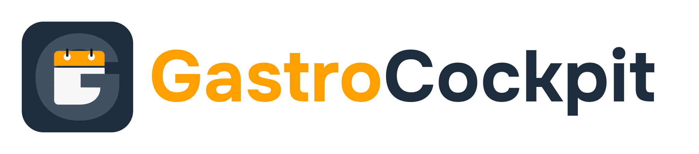

  
  <h3>Workforce Management für die Gastronomie</h3>
  
Mobile-first shift planning, time tracking & compliance for German restaurants

---

### What We Build

Gastro Cockpit helps restaurants, cafés, and bars manage their teams efficiently—without the spreadsheet chaos. We handle the complexity of German labor law so you can focus on hospitality.

**Built by a restaurateur managing 20+ employees across 2 locations.**

### Features

📅 Shift Planning · ⏱️ Time Tracking · 🔄 Shift Swaps · 📋 Leave Management · 📊 Compliance · 💶 Payroll Export

### Where We're Headed

**Today:** Reliable tools that eliminate spreadsheet chaos and keep you compliant.

**Tomorrow:** An AI co-manager that runs your location autonomously.

- 🤖 Auto-generated schedules optimized for coverage, cost & fairness
- 🔮 Predictive staffing based on reservations, weather & local events
- 🚨 Instant sick-leave replacement—one tap finds the best available substitute
- 🔄 Self-healing schedules that adapt to real-time changes

_Your AI manager that never sleeps, never forgets labor law, and never needs a coffee break._

### Our Vision

Enable small gastronomy businesses to access enterprise-grade workforce management—and eventually, the AI-powered operations that only large chains can afford today.

---

  <a href="https://gastrocockpit.de">Website</a> ·
  <a href="mailto:hello@gastrocockpit.de">Contact</a>

